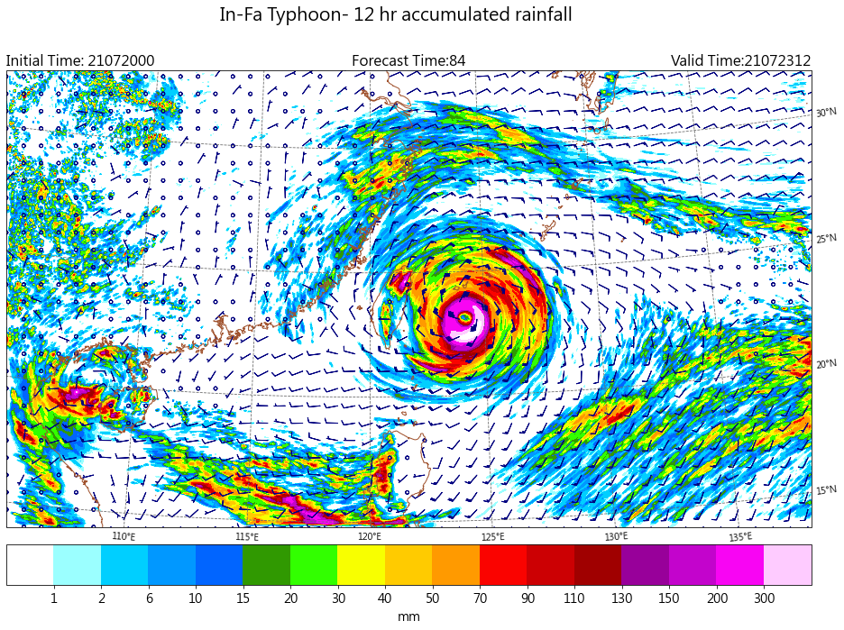

Rainfall
-----

Plotting rainfall contour with wind barb.

CWB regional numerical weather model data are used in this example.

Data format: Grib2

Data source: CWB opendata website

^^^^^

.. code-block:: python
    import numpy as np
    import pygrib as pb
    import cartopy.crs as crs
    import cartopy.io.shapereader as shpreader
    from cartopy.feature import ShapelyFeature
    from cartopy.mpl.gridliner import LONGITUDE_FORMATTER, LATITUDE_FORMATTER
    import matplotlib.pyplot as plt
    import matplotlib.ticker as mticker
    import cwbplot.cwb_colorbar as cwbcbar

    tau_72 = pb.open("M-A0064-21072000-072.grb2")
    tau_84 = pb.open("M-A0064-21072000-084.grb2")

    basicvar_72 = tau_72.select()[:]
    basicvar_84 = tau_84.select()[:]
    lon_0, lat_0 = basicvar_84[0]["LoVInDegrees"], basicvar_84[0]["LaDInDegrees"]
    lat_1, lat_2 = basicvar_84[0]["Latin1InDegrees"], basicvar_84[0]["Latin2InDegrees"]
    lats, lons = basicvar_84[0].latlons()
    analDate = basicvar_84[0].analDate.strftime("%y%m%d%H")
    fcst = str(basicvar_84[0].forecastTime)
    valDate = basicvar_84[0].validDate.strftime("%y%m%d%H")
    acc12rain = basicvar_84[61]["values"] - basicvar_72[61]["values"]
    u10m = basicvar_84[66]["values"]
    v10m = basicvar_84[67]["values"]
    
    
    lambert = crs.LambertConformal(central_longitude = lon_0, central_latitude = lat_0, 
                               standard_parallels = (lat_1,lat_2))

    coastline_shf = ShapelyFeature(shpreader.Reader("ne_10m_coastline.shp").geometries(), crs.PlateCarree(),
                               facecolor="none",edgecolor='sienna')

    fig = plt.figure(figsize=(16,12))
    axs = plt.axes(projection=lambert)
    axs.set_extent([lons[0,0], lons[0,-1], lats[0,0], lats[-1,-1]])
    axs.add_feature(coastline_shf)
    
    raincbar = cwbcbar.rain(style="NPD")
    ctf = plt.contourf(lons, lats, acc12rain, **raincbar, transform=crs.PlateCarree())
    gap = 25
    plt.barbs(lons[::gap,::gap], lats[::gap,::gap], u10m[::gap,::gap], v10m[::gap,::gap] ,\
            length=5,barbcolor="navy", transform=crs.PlateCarree())
    cbar = plt.colorbar(ctf,orientation='horizontal',pad=0.03,ticks=raincbar["levels"][1:-1])
    cbar.ax.tick_params(labelsize=14)
    cbar.set_label("mm",size=14)

    gl = axs.gridlines(draw_labels=True,x_inline=False, y_inline=False,linestyle='--',color='dimgray')
    gl.top_labels = False
    gl.left_labels = False
    gl.xlocator = mticker.FixedLocator(np.arange(110,140,5))
    gl.ylocator = mticker.FixedLocator(np.arange(10,51,5))
    gl.xformatter = LONGITUDE_FORMATTER
    gl.yformatter = LATITUDE_FORMATTER
    plt.title("Initial Time: {}".format(analDate), loc="left",fontsize=16)
    plt.title("Forecast Time:{}".format(fcst),loc="center",fontsize=16)
    plt.title("Valid Time:{}".format(valDate),loc="right",fontsize=16)
    plt.suptitle("In-Fa Typhoon- 12 hr accumulated rainfall",y=0.93,fontsize=20)
