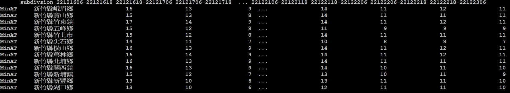
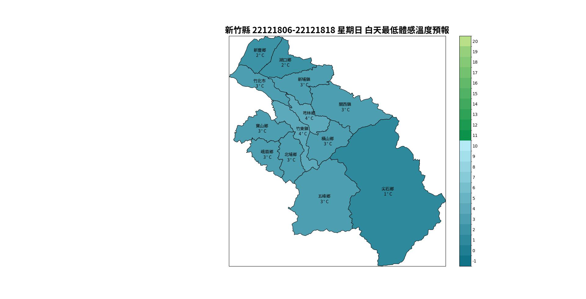

此範例搭配api處理縣市未來一週天氣預報資料-以新竹縣為例 F-D0047-011
----------------

Data Source: CWB opendata

^^^^^^^^^^

已下載xml或json檔案

.. code-block:: python
   
   from cwbplot import opdata
   
   xmlobj = opdata.read_xml("F-D0047-011.xml")
   #會回傳dataframe物件，內含所有的資訊

   jsonobj = opdata.read_json("F-D0047-011.json")
   #會回傳dataframe物件，內含所有的資訊

若想要全自動化，直接使用api

.. code-block:: python

   from cwbplot import opdata
   jsonobs = opdata.json_api("F-D0047-011","/home/staffid/cwbopdata/readme.api")
   #會回傳dataframe物件，內含所有的資訊，dtatframe的index為天氣變數(如T,MinAT)

畫個圖

.. code-block:: python
   
   import matplotlib.pyplot as plt
   import matplotlib as mpl
   from cwbplot import cwb_colorbar, opdata, chtfont
   import cartopy.crs as ccrs
   import cartopy.io.shapereader as shapereader
   from cartopy.feature import ShapelyFeature
   
   
   weeksfcst = opdata.json_api("F-D0047-011","readme.api")
   weeks_metvar = weeksfcst.loc["MinAT"]
   print(weeks_metvar) #可見下圖的dataframe形式
   df_hd = list(weeks_minAT)
   dictweekday= {"Sunday":"星期日", "Monday":"星期一", "Tuesday":"星期二",\
                 "Wednesday":"星期三", "Thursday":"星期四", "Friday":"星期五",\
                 "Saturday":"星期六"}
   color_dict =cwb_colorbar.surfT()
   level = color_dict["levels"].copy()
   colors = color_dict["cmap"].colors
   level.pop()
   subdivshp = shapereader.Reader("subdiv/TOWN_MOI_1111118.shp") 
   #shapefile請自行下載 https://whgis.nlsc.gov.tw/Opendata/Files.aspx
   for timeidx in range(5,6): #不要從0開始，因為0是subdivsion欄位
       fig = plt.figure(figsize=(16,16))
       ax = plt.axes(projection=ccrs.PlateCarree())
       timehd = df_hd[timeidx]
       boundlon, boundlat = [], []
       for countyinfo in weeks_metvar["subdivsion"]:
           countyname, townname = countyinfo[:3], countyinfo[3:]
           sub_metvar = int(weeks_metvar.query("subdivsion == '{}'".format(countyinfo))[timehd])
           eachtown = [town for town in subdivshp.records() if town.attributes["TOWNNAME"] == townname and town.attributes["COUNTYNAME"]==countyname][0]
           centerx = eachtown.geometry.centroid.x
           centery = eachtown.geometry.centroid.y
           bounds = eachtown.geometry.bounds
           for ith, bound in enumerate(bounds):
               boundlon.append(bound) if ith % 2 == 0. else boundlat.append(bound)
           fc = colors[level.index(sub_metvar)]
           shape_feature = ShapelyFeature([eachtown.geometry], ccrs.PlateCarree(), facecolor=fc, edgecolor='black', lw=0.8)
           ax.add_feature(shape_feature)
           if townname == "竹東鎮":
               ax.text(centerx+0.015,centery,townname +"\n " +str(sub_metvar)  + "$^\circ$C", ha="center",va="center",font=chtfont.taipei_nomo)
           else:
               ax.text(centerx,centery,townname +"\n " +str(sub_metvar)  + "$^\circ$C", ha="center",va="center",font=fpath)
       sttime = timehd.split("-")[0]
       endtime = timehd.split("-")[-1]
       if endtime[-2:] == "18":
           weekday = datetime.strptime(endtime,"%y%m%d%H").strftime("%A")
           figtitle = countyname+" "+ timehd + " " + dictweekday[weekday] + " " + "白天最低體感溫度預報"
       else:
           weekday = datetime.strptime(sttime,"%y%m%d%H").strftime("%A")
           figtitle = countyname+" "+ timehd + " " + dictweekday[weekday] + " " + "晚上最低體感溫度預報"
       ax.set_title(figtitle,font=chtfont.taipei_bold, fontsize = 20)
       changcmap = mpl.colors.ListedColormap(color_dict["cmap"].colors[:23])
       norm = mpl.colors.BoundaryNorm([pos+0.5 for pos in range(-1,22)], changcmap.N)
       cbar = fig.colorbar(mpl.cm.ScalarMappable(norm=norm, cmap=changcmap), ax=ax,pad=0.03)
       cbar.set_ticks( range(22), labels=range(-1,21))
       cbar.ax.tick_params(length=0)
       ax.set_extent([min(boundlon),max(boundlon),min(boundlat),max(boundlat)], ccrs.PlateCarree())
   
圖如下

