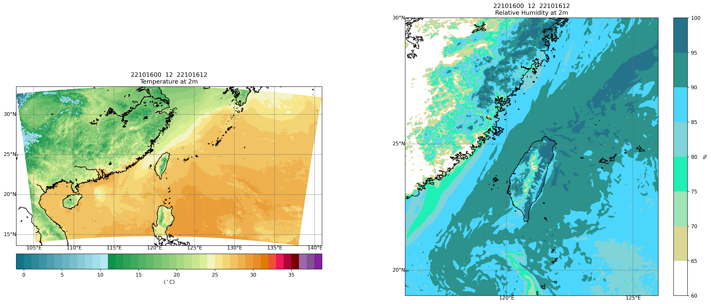

此範例處理數值預報模式-區域預報模式(WRF-3公里) M-A0064-???
----------------

Data Source: CWB opendata

^^^^^^^^^^

已下載grib2檔案

.. code-block:: python
   
   from cwbplot import opdata
   
   gb2data = opdata.read_grib("filename.grb2")
   #會回傳pygrib物件

畫個圖

.. code-block:: python

   import matplotlib.pyplot as plt
   import cwbplot.cwb_colorbar as cwbcbar
   from cwbplot import opdata, projinfo
   
   grib2info = opdata.read_grib("M-A0064-22101600-012.grb2")
   allvar = grib2info.select()[:]
   lats, lons = allvar[0].latlons()
   analDate = allvar[0].analDate.strftime("%y%m%d%H")
   fcst = str(allvar[0].forecastTime)
   valDate = allvar[0].validDate.strftime("%y%m%d%H")
   temp2m = allvar[62]["values"] - 273.15
   rh2m = allvar[65]["values"]

   fig,axs = plt.subplots(1,2,figsize=(24,10))
   tempcbar = cwbcbar.surfT()
   rhcbar = cwbcbar.rh(style="rhcc")
   for cnt, ax in enumerate(axs.flatten()):
       if cnt == 0:
           proj = projinfo.wrfd(lons,lats, domain="d02", res="f", projection="cyl", ax=ax)
           ctf = proj.contourf(lons, lats, temp2m, **tempcbar, latlon=True)
           cbar = plt.colorbar(ctf, orientation='horizontal', ax = ax,pad=0.03)
           cbar.set_label("($^\circ$C)")
           ax.set_title(f"{analDate}  {fcst}  {valDate}\nTemperature at 2m")
       else:
           proj = projinfo.wrfd(lons,lats, domain="d02", res="f", projection="cyl", \
                                cut=[116, 126, 19, 30], ax=ax)
           ctf = proj.contourf(lons, lats, rh2m, **rhcbar, latlon=True)
           cbar = plt.colorbar(ctf, ax = ax, fraction=0.05)
           cbar.set_label("%")
           ax.set_title(f"{analDate}  {fcst}  {valDate}\nRelative Humidity at 2m")
   proj.drawmeridians(np.arange(100,141,5), color='dimgray', labels=[0, 0, 0, 1], yoffset = 0 )
   proj.drawparallels(np.arange(10,51,5), color='dimgray', labels=[1, 0, 0, 0], xoffset = 0 )
   proj.drawcoastlines()
   plt.savefig("M-A0064.png", dpi=250, format="png", bbox_inches='tight')

圖如下

