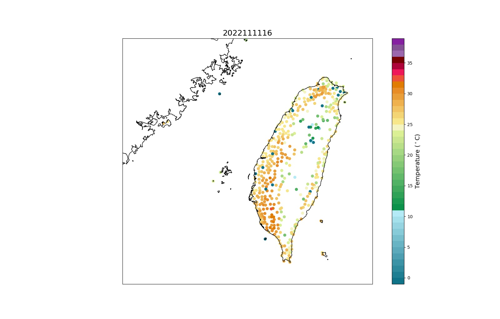

此範例處理自動氣象站-氣象觀測資料 O-A0001-001
----------------

Data Source: CWB opendata

^^^^^^^^^^

已下載xml或json檔案

.. code-block:: python
   
   from cwbplot import opdata
   
   dfxml = opdata.read_xml("O-A0001-001.xml")
   #會回傳pandas dataframe物件

   dfjson = opdata.read_json("O-A0001-001.json")
   #會回傳pandas dataframe物件

   print(list(dfjson))
   #header 如 ['time', 'stationId', 'locationName', 'lon', 'lat', 'lon_wgs84', 'lat_wgs84', 'ELEV', 'WDIR', 'WDSD', 'TEMP', 'HUMD', 'PRES', 'H_24R', 'H_FX', 'H_XD', 'H_FXT', 'D_TX', 'D_TXT', 'D_TN', 'D_TNT', 'CITY', 'CITY_SN', 'TOWN', 'TOWN_SN']

若想要全自動化，直接使用api

.. code-block:: python

   from cwbplot import opdata
   dfjson = opdata.json_api("O-A0001-001","/home/staffid/cwbopdata/readme.api")
   #會回傳pandas dataframe物件
   #readme.api的內容為您於氣象局開放資料申請的api，我的類似CWB-????????-????-????-????-????????????
   #?代表一個位數，可能是數字或英文字母

   print(list(dfjson))
   #header 如 ['time', 'lat', 'lon', 'locationName', 'stationId', 'ELEV', 'WDIR', 'WDSD', 'TEMP', 'HUMD', 'PRES', 'H_24R', 'H_FX', 'H_XD', 'H_FXT', 'D_TX', 'D_TXT', 'D_TN', 'D_TNT', 'CITY', 'CITY_SN', 'TOWN', 'TOWN_SN']

畫個圖

.. code-block:: python
   
   import matplotlib.pyplot as plt
   from cwbplot import cwb_colorbar, opdata
   from mpl_toolkits.basemap import Basemap

   df = opdata.json_api("O-A0001-001","/home/staffid/cwbopendata/readme.api")
   lat = df["lat"].astype(float).values
   lon = df["lon"].astype(float).values
   tempature = df["TEMP"].astype(float).values
   obstime = df["time"]

   surfT = cwb_colorbar.surfT()

   plt.figure(figsize=(16,12))
   m = Basemap(projection='merc',resolution="f",
                  llcrnrlon=117.5, llcrnrlat=21.5,
                  urcrnrlon=122.5, urcrnrlat=26)
   m.drawcoastlines()
   sct = m.scatter(lon, lat, c=tempature, cmap = surfT["cmap"], norm=surfT["norm"], latlon=True)
   cbar = plt.colorbar(sct)
   cbar.set_label("Temperature ($^\circ$C)",size=14)
   plt.title(obstime[0],fontsize=18)

圖如下

