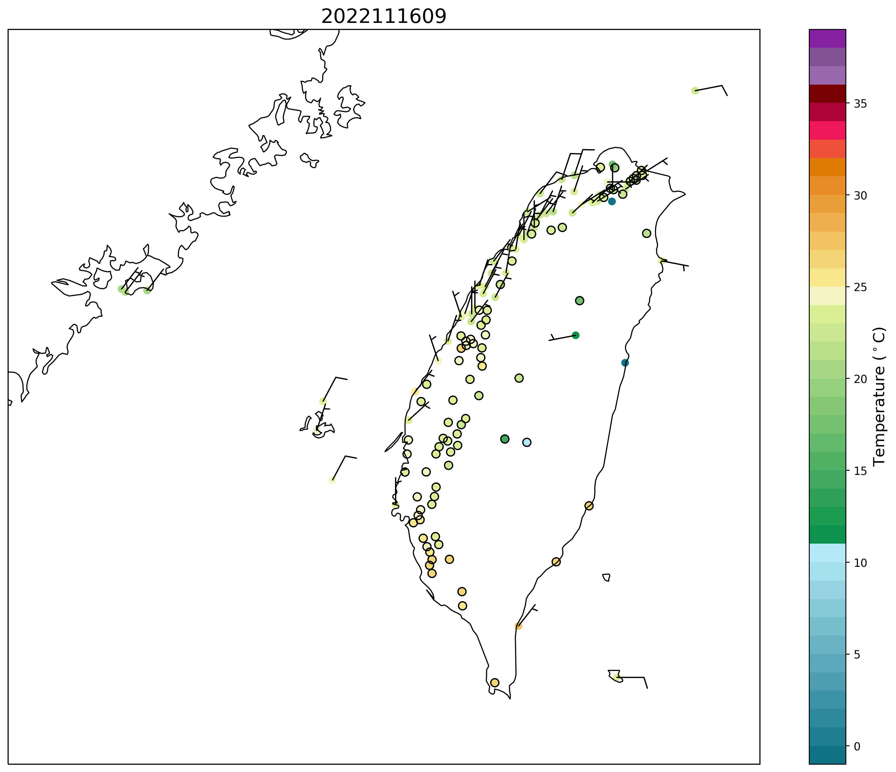

此範例處理局屬氣象站-現在天氣觀測報告   O-A0003-001
----------------

Data Source: CWB opendata

^^^^^^^^^^

已下載xml或json檔案

.. code-block:: python
   
   from cwbplot import opdata
   
   dfxml = opdata.read_xml("O-A0003-001.xml")
   #會回傳pandas dataframe物件

   dfjson = opdata.read_json("O-A0003-001.json")
   #會回傳pandas dataframe物件

   print(list(dfjson))
   #header 如 ['time', 'stationId', 'locationName', 'lon', 'lat', 'lon_wgs84', 'lat_wgs84', 'ELEV', 'WDIR', 'WDSD', 'TEMP', 'HUMD', 'PRES', 'H_24R', 'H_FX', 'H_XD', 'H_FXT', 'D_TX', 'D_TXT', 'D_TN', 'D_TNT', 'CITY', 'CITY_SN', 'TOWN', 'TOWN_SN']

若想要全自動化，直接使用api

.. code-block:: python

   from cwbplot import opdata
   dfjson = opdata.json_api("O-A0003-001","/home/staffid/cwbopdata/readme.api")
   #會回傳pandas dataframe物件
   #readme.api的內容為您於氣象局開放資料申請的api，我的類似CWB-????????-????-????-????-????????????
   #?代表一個位數，可能是數字或英文字母

   print(list(dfjson))
   #header 如 ['time', 'lat', 'lon', 'locationName', 'stationId', 'ELEV', 'WDIR', 'WDSD', 'TEMP', 'HUMD', 'PRES', 'H_24R', 'H_FX', 'H_XD', 'H_FXT', 'D_TX', 'D_TXT', 'D_TN', 'D_TNT', 'CITY', 'CITY_SN', 'TOWN', 'TOWN_SN']

畫個圖

.. code-block:: python
   
   import matplotlib.pyplot as plt
   import cartopy.crs as ccrs
   import cartopy.feature as cfeature
   import numpy as np
   from cwbplot import cwb_colorbar, opdata

   df = opdata.read_xml("O-A0003-001.xml")
   lat = df["lat"].astype(float).values
   lon = df["lon"].astype(float).values
   tempature = df["TEMP"].astype(float).values
   wdir = df["WDIR"].astype(float).values
   wdir[wdir < 0.0 ] = np.nan
   wspd = df["WDSD"].astype(float).values
   #換算為u及v
   rad = 4.0 * np.arctan(1)/180.
   u = -wspd * np.sin(rad * wdir)
   v = -wspd * np.cos(rad * wdir)
   obstime = df["time"]

   plt.figure(figsize=(16,12))
   ax = plt.axes(projection=ccrs.Mercator())
   ax.add_feature(cfeature.COASTLINE.with_scale('10m'))
   surfT = cwb_colorbar.surfT()
   sct = ax.scatter(lon, lat, c=tempature, cmap = surfT["cmap"], norm=surfT["norm"], transform=ccrs.PlateCarree())
   ax.barbs(lon, lat, u, v, transform=ccrs.PlateCarree())
   ax.set_extent([117.5, 122.5, 21.5, 26])
   cbar = plt.colorbar(sct,ax=ax)
   cbar.set_label("Temperature ($^\circ$C)",size=14)
   plt.title(obstime[0],fontsize=18)
   plt.savefig("O-A0003-001.png", format='png', bbox_inches='tight', dpi=250)

圖如下

