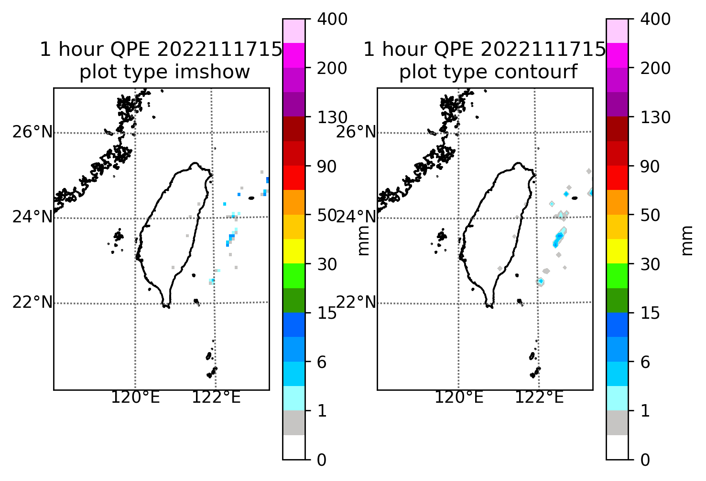

此範例處理降雨估計資料-QPESUMS過去1小時定量降雨估計格點資料 O-B0045-001
----------------

Data Source: CWB opendata

^^^^^^^^^^

已下載xml或json檔案

.. code-block:: python
   
   from cwbplot import opdata
   
   xmlobj = opdata.read_xml("O-B0045-001.xml",)
   #會回傳tuple物件，分別為(降雨估計值, 經度格點, 緯度格點, 觀測時間)

   jsonobj = opdata.read_json("O-B0045-001.json")
   #會回傳tuple物件，分別為(降雨估計值, 經度格點, 緯度格點, 觀測時間)

若想要全自動化，直接使用api

.. code-block:: python

   from cwbplot import opdata
   jsonobs = opdata.json_api("O-B0045-001","/home/staffid/cwbopdata/readme.api")
   #會回傳tuple物件，分別為(降雨估計值, 經度格點, 緯度格點, 觀測時間)

畫個圖

.. code-block:: python
   
   import matplotlib.pyplot as plt
   from cwbplot import cwb_colorbar, opdata, projinfo
   qpe, lon, lat, obstime = opdata.json_api("O-B0045-001","readme.api")
   
   fig, axs = plt.subplots(1,2)
   raincm = cwb_colorbar.rain()
   for cnt, ax in enumerate(axs.flatten()):
       proj = projinfo.wrfd(lon=lon, lat=lat, res = "f", domain="d02", cut = [lon[0,0],lon[-1,-1],lat[0,0],lat[-1,-1]], ax=ax)
       if cnt == 0:
          graph = proj.imshow(qpe, cmap=raincm["cmap"], norm=raincm["norm"], origin="lower")
          plttype = "imshow"
       else:
          graph = proj.contourf(lon, lat, qpe, cmap=raincm["cmap"], norm=raincm["norm"], levels=raincm["levels"], latlon=True)
          plttype = "contourf"
       proj.drawcoastlines()
       proj.drawmeridians([120,122], color='dimgray', labels=[0, 0, 0, 1], yoffset = 0 )
       proj.drawparallels([22,24,26], color='dimgray', labels=[1, 0, 0, 0], xoffset = 0 )
       cbar = plt.colorbar(graph,ax=ax)
       cbar.set_label("mm")
       ax.set_title(f"1 hour QPE {obstime}\n plot type {plttype}")
   plt.savefig("O-B0045-001.png", format='png', bbox_inches='tight', dpi=250)

   
圖如下

