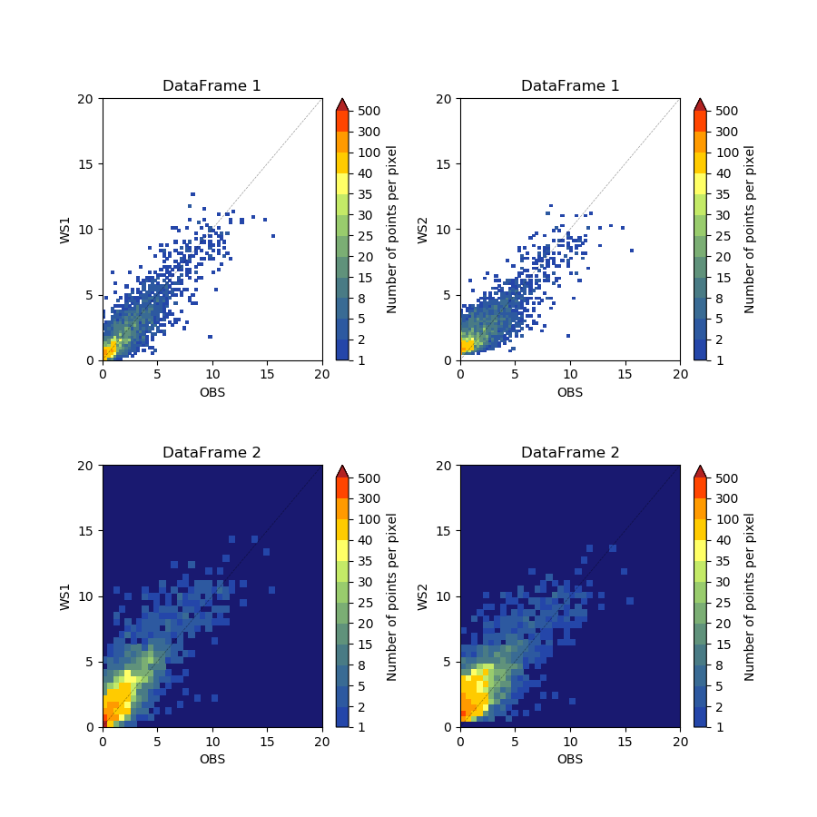

Hist2d for frqency scatter plot
-----

Plotting point distribution by frequecy template 

Data format: csv

Data source: Self test

^^^^^

.. code-block:: python

    import numpy as np
    import pandas as pd
    import matplotlib.pyplot as plt
    from matplotlib import colors
    from cwbplot import cwb_colorbar as cwbcbar

    df1 = pd.read_csv("example_1.csv")
    df2 = pd.read_csv("example_2.csv")

    fig,axs = plt.subplots(2,2,figsize=(9,9))
    plt.subplots_adjust(hspace=0.4,wspace=0.3)
    freq = cwbcbar.freq()
    overcolor = "firebrick"
    limvalue = 20
    tickspos = np.arange(0,limvalue+1,5)

    cnt = 0
    for picx in axs.flatten():
        if cnt % 2 == 0:
            col = 1
        if cnt < 2:
            sct = picx.hist2d(df1["OBS"], df1.iloc[:, col],bins = (60,60), **freq)
            picx.set_title("DataFrame 1")
            col += 1
        else:
            picx.set_facecolor('midnightblue')
            sct = picx.hist2d(df2["OBS"], df2.iloc[:, col],bins = (30,30), **freq)
            picx.set_title("DataFrame 2")
            col += 1
        cnt += 1
        sct[3].cmap.set_under("None")
        sct[3].cmap.set_over(overcolor)
        cbar = plt.colorbar(sct[3],ax=picx,extend="max",ticks=freq["norm"].boundaries)
        cbar.ax.minorticks_off()
        cbar.set_label("Number of points per pixel")
        picx.set_xticks(tickspos)
        picx.set_yticks(tickspos)
        picx.set_xlim(0,limvalue)
        picx.set_ylim(0,limvalue)
        picx.plot([0,limvalue],[0,limvalue],'k--',linewidth=0.5,alpha=0.4)
        picx.set_xlabel("OBS")
        picx.set_ylabel("WS{:d}".format(col-1))
