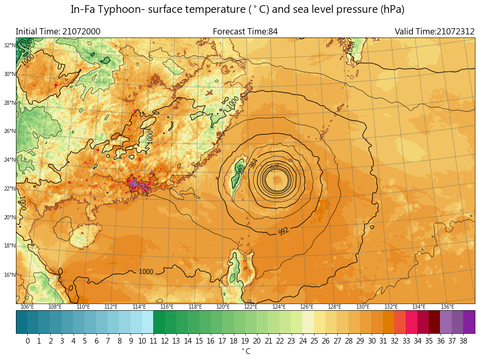

Performance digram
-----

^^^^^

.. code-block:: python

   import matplotlib.pyplot as plt
   from cwbplot import dia

   fig = plt.figure(figsize=(12,8))
   mks = ["^", "+","*",'>']
   colors = ["darkviolet","brown","sienna","tomato"]
   xx = [[0.3,0.4,0.5],[0.6,0.7,0.9],[0.2,0.5,0.9],[0.1,0.3,0.65]]
   yy = [[0.1,0.8,0.9],[0.6,0.7,0.95],[0.11,0.55,0.66],[0.12,0.35,0.44]]
   labels = ["a","b","c","d"]
   perfombg = dia.perform_dig(fig)
   for i in range(4):
       perfombg.scatter(xx[i],yy[i],color=colors[i],marker=mks[i],zorder=2,label=labels[i])
   plt.legend(ncol=4,loc='lower center',bbox_to_anchor=(0.5, -0.1))
   plt.show()
