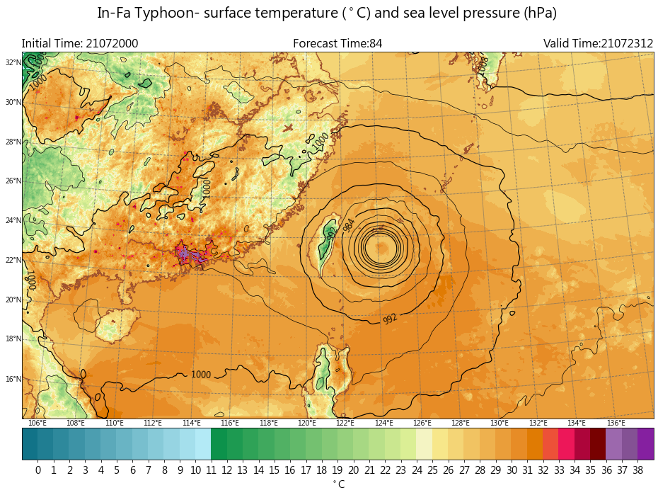

Streamline and Relative Humidity
-----

Plotting rainfall contour with wind barb.

CWB regional numerical weather model data are used in this example.

Data format: Grib2

Data source: CWB opendata website

^^^^^

.. code-block:: python

   import numpy as np
   import pygrib as pb
   import matplotlib.pyplot as plt
   from mpl_toolkits.basemap import Basemap
   import cwbplot.cwb_colorbar as cwbcbar

   tau_84 = pb.open("M-A0064-21072000-084.grb2")

   basicvar_84 = tau_84.select()[:]
   lon_0, lat_0 = basicvar_84[0]["LoVInDegrees"], basicvar_84[0]["LaDInDegrees"]
   lat_1, lat_2 = basicvar_84[0]["Latin1InDegrees"], basicvar_84[0]["Latin2InDegrees"]
   lats, lons = basicvar_84[0].latlons()
   proj = Basemap(projection="lcc",resolution='h',lat_0 = lat_0 ,lon_0 = lon_0 ,lat_1 = lat_1, \
           lat_2 = lat_2, llcrnrlat = lats[0,0], llcrnrlon = lons[0,0], urcrnrlat = lats[-1,-1], \
           urcrnrlon = lons[-1,-1])

   analDate = basicvar_84[0].analDate.strftime("%y%m%d%H")
   fcst = str(basicvar_84[0].forecastTime)
   valDate = basicvar_84[0].validDate.strftime("%y%m%d%H")

   rh850 = tau_84.select(parameterName="Relative humidity", level=850)[0]["values"]
   rh850[rh850<=65] = np.nan
   u850 = tau_84.select(parameterName="u-component of wind", level=850)[0]["values"]
   v850 = tau_84.select(parameterName="v-component of wind", level=850)[0]["values"]
   
   fig = plt.figure(figsize=(16,12))
   xx, yy = proj.makegrid(v850.shape[1], v850.shape[0], returnxy=True)[2:4]
   dictstream = {"arrowstyle":"-|>","linewidth":0.5,"color":"darkred"}
   proj.streamplot(xx[::20, ::20], yy[::20, ::20], u850[::20, ::20], v850[::20, ::20], **dictstream)
   proj.drawcoastlines(linewidth=0.8, color='k')
   proj.drawlsmask(land_color='peachpuff',ocean_color='None')
   ctf = proj.contourf(lons, lats, rh850, cmap = "YlGnBu", alpha=0.8, latlon = True)
   cbar = plt.colorbar(ctf,orientation='horizontal',pad=0.02)
