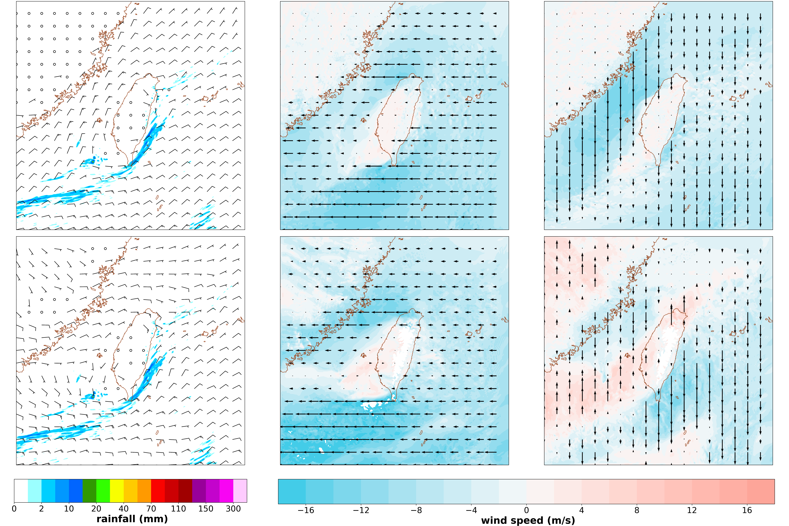

Two colorbars in one Figure
-----

Plotting 10m and 850 hPa height wind speed and direaction (quiver)

CWB regional numerical weather model data are used in this example.

Data format: NetCDF4

Data source: Self running WRF output

^^^^^

.. code-block:: python

   import matplotlib.pyplot as plt
   import numpy as np
   import cwbplot.cwb_colorbar as cwbcbar
   import wrf
   import netCDF4 as nc4
   import colorcet
   from mpl_toolkits.axes_grid1 import make_axes_locatable

   fn = nc4.Dataset("wrfout2")
   rainfall = fn["RAINNC"][0] + fn["RAINC"][0] + fn["RAINSH"][0]
   lat = fn["XLAT"][0]
   lon = fn["XLONG"][0]
   pressure = wrf.getvar(fn,"pressure")
   u = wrf.getvar(fn,"ua")
   v =wrf.getvar(fn,"va")
   u850 = wrf.interplevel(u,pressure,850).data
   v850 =wrf.interplevel(v,pressure,850).data
   u10 = fn["U10"][0]
   v10 = fn["V10"][0]
   uvmin = min(u10.min(),v10.min(),u850.min(),v850.min())
   uvmax = max(u10.max(),v10.max(),u850.max(),v850.max())

   if uvmin < 0 and uvmax >= 0:
       realmax = max(abs(uvmin),uvmax)
       uvmin = -(int(realmax)+1)
       uvmax = int(realmax)+1

   levels = list(range(uvmin,uvmax+1,2))
   zerouv = np.zeros(u10.shape)

   tows = lambda uw,vw: (uw**2+vw**2)**0.5
   ws850 = tows(u850,v850)
   ws10 = tows(u10,v10)
   
   proj = wrf.get_basemap(pressure, resolution="h")

   raincbar = cwbcbar.rain(style="NPD")

   fig, axs = plt.subplots(2,3, figsize=(27,18),constrained_layout=True)
   cnt = 0
   gap=25
   windcmap =colorcet.cm.diverging_tritanopic_cwr_75_98_c20
   for ax in axs.flatten():
       proj.drawcoastlines(linewidth=1, color='sienna',ax=ax)
       if cnt%3 == 0:
           rainctf = proj.contourf(lon,lat,rainfall, **raincbar,ax=ax,latlon=True)
           if cnt == 0:
               proj.barbs(lon[::gap,::gap],lat[::gap,::gap],u10[::gap,::gap],v10[::gap,::gap],length=6, ax=ax,latlon=True)
           else:
               proj.barbs(lon[::gap,::gap],lat[::gap,::gap],u850[::gap,::gap],v850[::gap,::gap], length=6,ax=ax,latlon=True)
       elif cnt ==1:
           windctf = proj.contourf(lon,lat,u10,ax=ax,cmap=windcmap,levels=levels, latlon=True)
           proj.quiver(lon[::gap,::gap],lat[::gap,::gap],u10[::gap,::gap], zerouv[::gap,::gap], ax=ax,latlon=True)
       elif cnt ==2:
           windctf = proj.contourf(lon,lat,v10,ax=ax,cmap=windcmap,levels=levels, latlon=True)
           proj.quiver(lon[::gap,::gap],lat[::gap,::gap],zerouv[::gap,::gap],v10[::gap,::gap],  ax=ax,latlon=True)
       elif cnt ==4:
           windctf = proj.contourf(lon,lat,u850,ax=ax,cmap=windcmap,levels=levels, latlon=True)
           proj.quiver(lon[::gap,::gap],lat[::gap,::gap],u850[::gap,::gap], zerouv[::gap,::gap], ax=ax,latlon=True)
       elif cnt ==5:
           windctf = proj.contourf(lon,lat,v850,ax=ax,cmap=windcmap,levels=levels, latlon=True)
           proj.quiver(lon[::gap,::gap],lat[::gap,::gap],zerouv[::gap,::gap],v850[::gap,::gap], ax=ax,latlon=True)
       cnt+=1

   cbar = fig.colorbar(rainctf, ax=[axs[1, 0]], aspect=10,shrink=0.9,location='bottom')
   cbar.set_label(label=' rainfall (mm)', size=24, weight='bold')
   cbar.ax.tick_params(labelsize=20)
   cbar = fig.colorbar(windctf, ax= axs[1, 1:],shrink=0.95,location='bottom')
   cbar.set_label(label=' wind speed (m/s)', size=24, weight='bold')
   cbar.ax.tick_params(labelsize=20)
   plt.show()

