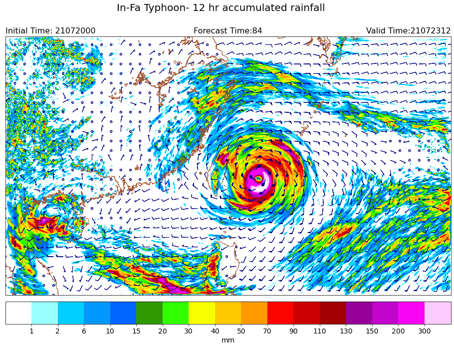

Gallery
=====

Basemap
-----
The projection setting of this graph is done by basemap, but strongely change to use cartopy. 

   
   TEST- :ref: `example/12accrain_basemap.rst`
     

     
   
   Rainfall 
   
.. toctree::
    :maxdepth: 1
    :hidden:
    
    example/12accrain_basemap

Cartopy
-----
