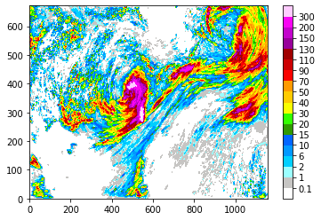

How to use
=====

colorbar_example
-----

.. code-block:: python

   import numpy as np
   
   rainfall = np.load("/home/c052/work/opendata/21080606/rainfall.npy")
   
   t2m = np.load("/home/c052/work/opendata/21080606/t2m.npy")
   
   ygrids, xgrids = rainfall.shape
   
   xx, yy = np.meshgrid(np.linspace(0, xgrids-1, xgrids),np.linspace(0,ygrids-1, ygrids))

 
   
