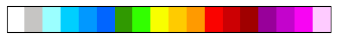
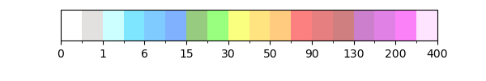
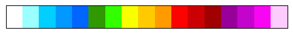
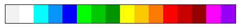
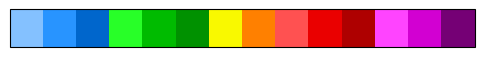
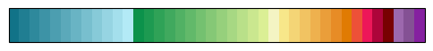

Getting started
=====

Installation
-------------

 >>> pip install cwbplot

Required Dependencies
^^^^^^^^^^^^^^^^^^^^^^

    - Python 3.6 or later
    - numpy (1.17.3 or later)
    - pygrib (2.0.4 or later)
    - basemap (1.2.1 or later)
    - requests (2.25.0 or later)
    - matplotlib (3.3.3 or later)
    - setuptools (38.0 or later) 

Highly Recommended Packages
^^^^^^^^^^^^^^^^^^^^^^^^^^^

    - gdal (2.4.1 or later)
    

Plotting Packages
^^^^^^^^^^^^^^^^^^

    - cartopy (0.13 or later)

CWB open data IO
-------------------

example
^^^^^^^^^

json file

.. code-block:: python
   
   from cwbplot import opdata
   out = opdata.read_xml("jsonfile")

api(Only Json)

.. code-block:: python
   
   from cwbplot import opdata
   out = opdata.json_api("opend dataid","apipath")

Colorbar
-----

example
^^^^^
.. code-block:: python

   import numpy as np
   import cwbplot.cwb_colorbar as cwbcolor #import cwbcolorbar 模組
   import matplotlib.pyplot as plt
   
   rainfall = np.load("/home/c052/work/opendata/21080606/rainfall.npy")
   
   t2m = np.load("/home/c052/work/opendata/21080606/t2m.npy")
   
   ygrids, xgrids = rainfall.shape
   
   xx, yy = np.meshgrid(np.linspace(0, xgrids-1, xgrids),np.linspace(0,ygrids-1, ygrids))
   raincb = cwbcolor.rain() #使用rain()方法，回傳雨量colorbar的物件
   plt.contourf(xx, yy, rainfall, **raincb)

   #設定「直」的colorbar跟tick label
   cbstr = [ str(i) for i in raincb["levels"][1:-1]] 
   cbar = plt.colorbar(ticks=raincb["levels"][1:-1])
   newticks = cbar.ax.set_yticklabels(cbstr)

.. image:: ./image/raincolorbar_cwbrfs.png
 

colormap
^^^^^

**Rainfall-**

*nwprfs (default)* 

.. py:method:: `cwbplot.cwb_colorbar.rain`

*nwprfs half transparency* rain(style='nwprfs_light1')

*NPD* rain(style="NPD")

**Radar-**

*mosaic (default)* radar()

*cwbweb* radar(style="cwbweb")

**Surface** **Temprature-**

*cwbweb (default)* surfT()

